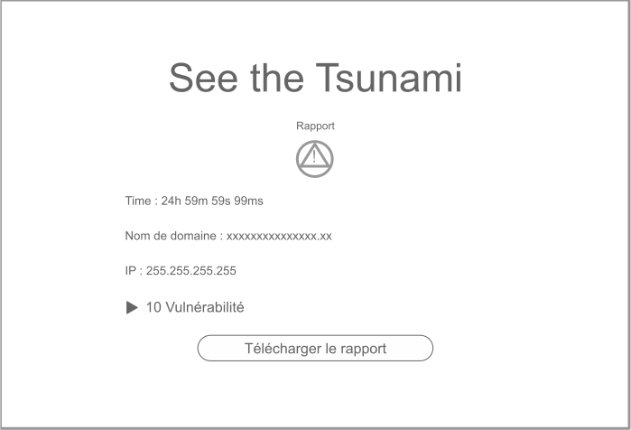
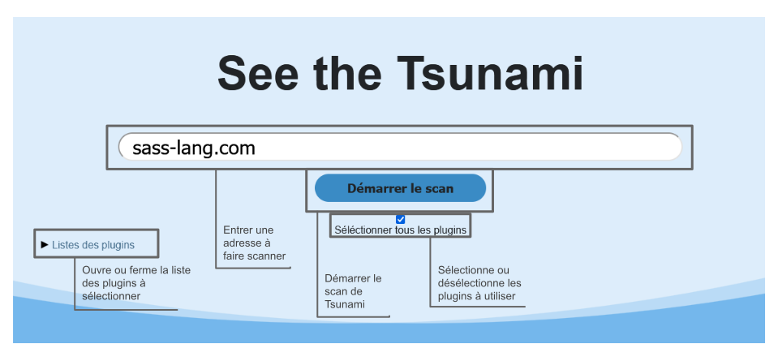

# Front-end

# Technologie

Builder : **Docker**

Environnement d’exécution : [**Node.js (nodejs.org)**](https://nodejs.org/fr/)

Langage : **Javascript**

Framwork : [**React JS**](https://fr.reactjs.org/)

API : [**Back-end**](../back-the-tsunami)


# Maquette

## Lancer le scan d’une adresse

.svg)

## Consulter les résultat



# Utilisation

## Lancer le scan d’une adresse



# Docker

## Installation

Afin de lancer le serveur front-end avec docker, vous devrez créer un clone du repository du projet et accéder au répertoire **front-the-tsunami**, puis construire une image en ligne de commande :

```bash
docker build --build-arg PORT=3001 --build-arg DOMAIN_API=http://localhost:3000 -t front-the-tsunami ./ 
```

Vous pouvez définir le port sur le quel tourneras le serveur en modifiant la valeur de **PORT** et définir l’adresse de l’API en modifiant la valeur **DOMAIN_API**

Ensuite lancer une image front-the-tsunami avec la commande :

```bash
docker run -p 3001:3001 --name front-the-tsunami -d front-the-tsunami
```

pensez a modifier le port selon votre choix précédent

Voila le serveur front-end est maintenant up vous pouvez maintenant ouvrir sur un navigateur l’adresse `http://localhost:3001` pour consulter le site

## Détail de fonctionnement

### Stage 1

- Utilisation de l’image **node:16-alpine** comme base pour l’image de la partie front
- Récupération de l’argument **PORT** et **DOMAIN_API**
- Copie du projet **front-the-tsunami**
- Construction des dépendences **Node** du projet
- Ajout des variables d’environment
- Ouverture du port **PORT**
- Lancement du serveur node